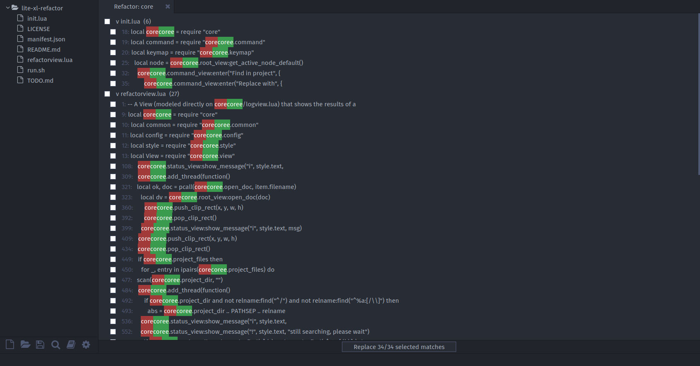

# Refactor

A plugin for Lite XL that adds minimal refactoring functionality.

> [!NOTE]
> This plugin is in BETA!

## Features

- Dedicated Tab to display a preview of the search/replacement process
- Toggle result to exclude search instance from being replaced
- Virtual lines to collapse all search instances within the same file (like in treeview/todotreeview/logview)
- Highlight matched text with red and new text with green

